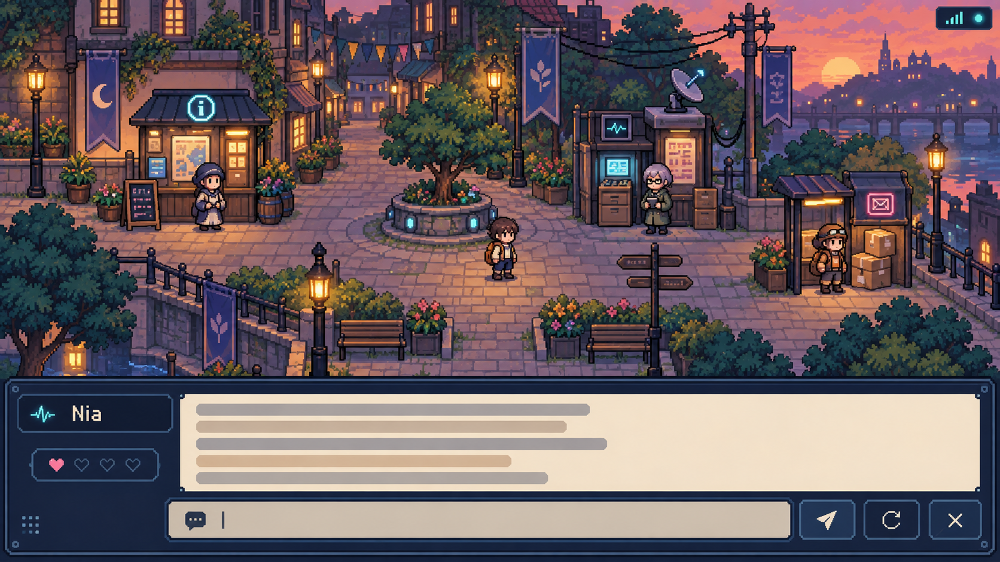
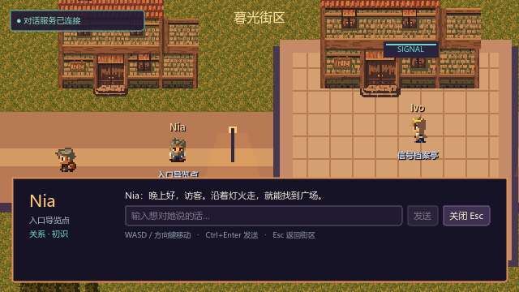
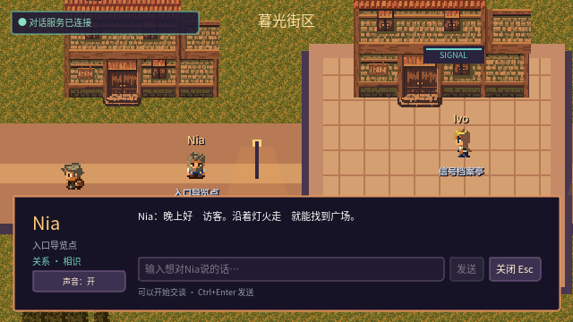

# Cyber Town 基础可玩版本：视觉基线候选 v1

更新时间：2026-09-22

状态：`APPROVED`（用户于 2026-09-21 批准；正式任务编号为 `F-010`）

## 1. 代表性画面

本图由 OpenAI 内置图像生成工具生成，只用于冻结构图、色彩、空间层级和对话面板比例，不是可直接导入游戏的地图、图块、角色或 UI 资产。

生成文件：`docs/design/playable-town/concept-v1.png`

目标实机视口仍为 `640 × 360`；概念图的高分辨率只方便评审，实施时必须按实际 16×16 像素素材和整数倍缩放重新搭建。

## 2. 已冻结的方向

- 俯视偏三分之四的经典 2D RPG 视角，可看到建筑正面。
- 暖色傍晚：琥珀窗灯与蓝紫阴影并存，整体亲切，轻量使用青色和洋红色信号灯。
- 一条短街连接一个小广场；玩家出生点位于南侧入口。
- Nia 位于入口导览亭，Ivo 位于信号档案亭，Rhea 位于街尾投递点。
- 地图与角色使用统一的低分辨率像素尺度；中文正文优先清晰可读。
- 底部面板约占视口高度 32%，背景城镇继续可见。
- 对话 UI 显示 NPC 名称、对话记录、输入区、发送、重试、关闭和关系阶段；不使用独立人物肖像。
- 后端状态为右上角弱提示，不把工程诊断信息放进正常玩家流程。

建议色板：

| 用途 | 颜色 |
| --- | --- |
| 深色 UI / 夜影 | `#15243B` |
| 蓝紫环境阴影 | `#41516E` |
| 建筑陶土色 | `#B66755` |
| 路灯与窗光 | `#F0B35D` |
| 正文和浅色表面 | `#F1DFC2` |
| 绿植 | `#657B66` |
| 信号强调色 | `#4CCAD1` |
| 关系变化强调色 | `#D66A93` |

## 3. 概念图与实际实现的有意差异

- 实际角色和物件会比概念图更简化，以选定的 16×16 素材为准。
- 概念图中的远景城市、河面和桥梁不进入首版地图。
- 概念图中的心形图标只是气氛表达；实机默认只显示“初识 / 相识 / 朋友 / 可信伙伴”和“关系升温 / 降温”。
- 实机中文对话记录最多显示当前 NPC 最近六个成功回合，概念图中的灰线只代表布局。
- 实机不会把生成图裁切成游戏素材，也不会手工临摹第三方素材。

## 4. 当前素材候选与许可

下列候选信息来自作者或发行方页面。最终只采用 Tiny RPG Fantasy、Kenney UI/RPG Audio 和 Noto Sans CJK SC；下载来源、包内许可证及字体哈希已记录在 `game/assets/third_party/THIRD_PARTY_ASSETS.md`。

### 推荐主体系：Tiny RPG Fantasy

- 作者：Ansimuz。
- 页面：https://ansimuz.itch.io/tiny-rpg-town
- 当前页面许可：Creative Commons Zero v1.0 Universal；作者页面明确允许免费资产用于个人或商业项目、修改和再分发。
- 免费内容：16×16 城镇图块、道路、水体、建筑、树木、道具、英雄和 NPC 动画，以及独立的城镇音乐包。
- 选择理由：单一作者同时提供地图、人物与城镇音乐，最容易形成统一的温暖小镇画面；允许修改，适合用 Godot 灯光和色调叠加实现暖色傍晚。
- 缺口：原始主题偏幻想乡镇，轻科幻部分需要使用简单的灯光、信号屏和几何装饰补足；概念图的城市密度不会完全复现。

### 候选 A：Ninja Adventure

- 作者：Pixel-boy。
- 页面：https://pixel-boy.itch.io/ninja-adventure-asset-pack
- 当前页面许可：Creative Commons Zero v1.0 Universal；页面声明可用于商业项目且无需署名，并标记未使用生成式 AI。
- 内容：50+ 动画角色、室内外图块、UI、100+ 音效、37 首音乐和 Godot 4 示例项目。
- 优点：单包完整度最高，动画、声音和 Godot 接入风险最低。
- 不选为首选的原因：忍者和战斗主题过强，需要大量筛选才能维持日常小镇气质。

### 候选 B：MetroCity

- 作者：JIK-A-4。
- 环境：https://jik-a-4.itch.io/metro
- 角色：https://jik-a-4.itch.io/metrocity-free-topdown-character-pack
- 当前页面许可：两包均标记 Creative Commons Zero v1.0 Universal，页面标记未使用生成式 AI。
- 内容：道路、建筑、树木、房屋，以及三种基础角色、服装和四方向跑步动画。
- 优点：城市题材最接近 Cyber Town。
- 风险：素材仍在开发中，规模和动画完整度弱于前两项；作者评论区曾说明侧面和背面发型动画仍有缺口，不能在未检查下载包前承诺四向外观完整。

### 配套 UI、音效与字体

- UI：Kenney UI Pack - Pixel Adventure，CC0，https://kenney.nl/assets/ui-pack-pixel-adventure
- 提示音：Kenney RPG Audio，CC0，https://kenney.nl/assets/rpg-audio
- 中文字体：Noto Sans CJK SC 或 Source Han Sans SC；官方仓库采用 SIL Open Font License 1.1：
  - https://github.com/notofonts/noto-cjk
  - https://github.com/adobe-fonts/source-han-sans/blob/master/LICENSE.txt

实际落地优先使用主体系自带的地图、角色和音乐；Kenney 只补 UI 框体与短提示音，中文正文使用 CJK 字体，不额外混入第三套场景像素素材。

## 5. 实施前检查表

- [x] 用户批准本视觉基线。
- [x] 用户确认任务编号为 `F-010`。
- [x] 下载前重新核对最终候选页面与包内许可证。
- [x] 记录下载 URL、时间、文件名和许可证副本；来源清单见 `game/assets/third_party/THIRD_PARTY_ASSETS.md`。
- [x] 只下载获批的 Tiny RPG Fantasy 主体系及 Kenney UI/音频配套，没有下载其他两套场景候选。
- [x] 设计批准后才修改 `game/` 和运行 Godot 相关验证。

## 6. 第一个真实 Godot 状态

- 状态：`APPROVED`（用户于 2026-09-22 通过首个实机视觉门禁）。
- 视口：`640 × 360`；确定性正常状态固定为“服务已连接、Nia 面板打开”。
- 可见内容：出生区、Nia 入口导览点、Ivo 信号档案亭、玩家、道路、广场、轻科幻标牌、连接状态和底部中文对话面板。Rhea 位于街区右端，需继续探索才能看到。
- 与概念图的有意差异：实际使用 16×16 CC0 图集；地图按约 2.25 个屏幕面积展开，因此单个玩家视口不会同时展示三名 NPC；没有河流、肖像、心形或任务图标。
- v1 截图保留为自检记录；v2 修正了过亮草地和半透明面板造成的底色不均，是本轮用户验收候选。
- 本截图由 Godot 4.7.2 实际渲染并通过固定命令保存；正常状态数据是视觉 fixture，不是后端或真实模型运行证据。

完整对话接入后的当前画面：

- `640 × 360`，SHA-256 `B55691AD79360676CF5A717384EF59DC21E576F2C3C7C1320BA35AA4D646EEEE`。
- 使用项目内完整 Noto Sans CJK SC OFL 字体，显示相识阶段、输入、发送、关闭和会话内静音。
- 本图只证明 Godot 实际渲染状态；fake HTTP 功能结果、用户手感验收和真实模型 UAT 分别记录，不能互相替代。

## 7. 图像生成记录

- 模式：OpenAI 内置 `image_gen`。
- 用途分类：`stylized-concept`。
- 生成次数：1。
- 约束：暖色傍晚、一个玩家、三名 NPC、一街一广场、底部对话面板、无战斗、无车辆、无室内、无肖像、无任务标记。
- 原始生成目录由 Codex 管理；项目内副本为本文件引用的 `concept-v1.png`。
